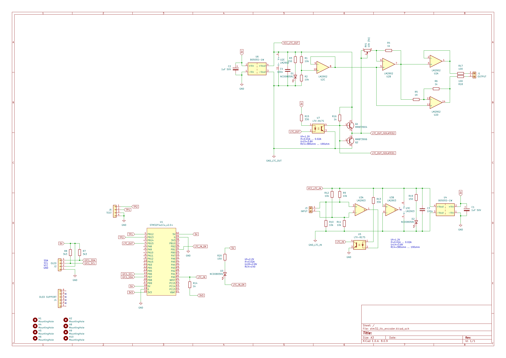
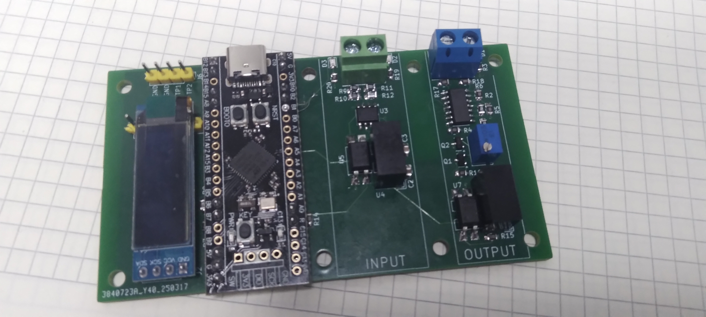
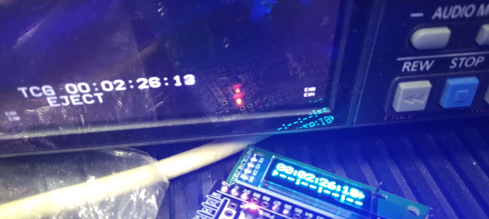
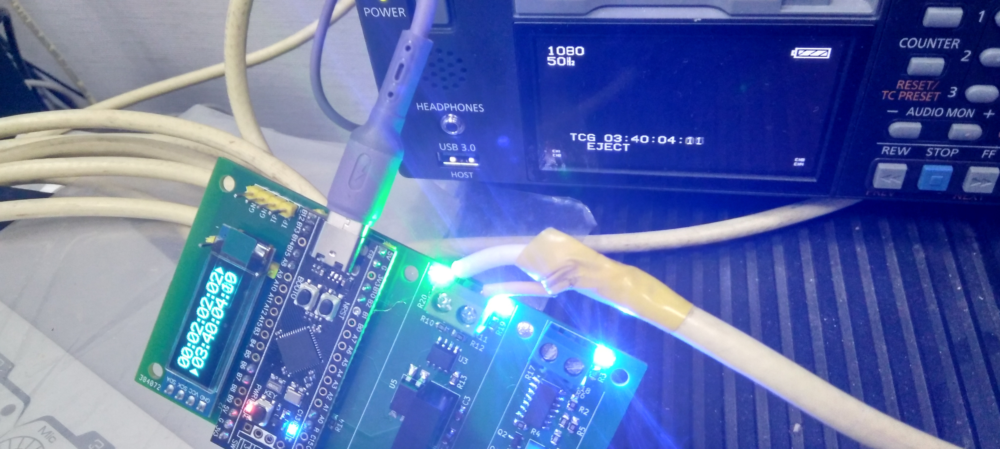

# stm32_ltc_encoder

This device used for decoding/encoding LTC (EBU Linear timecode) from/to VTRs or other sources.

Decoded Output sent to CDC serial. Encoding control cli available on second CDC serial.

## schematic

## photo

## encoding/generating LTC

## decoding LTC

